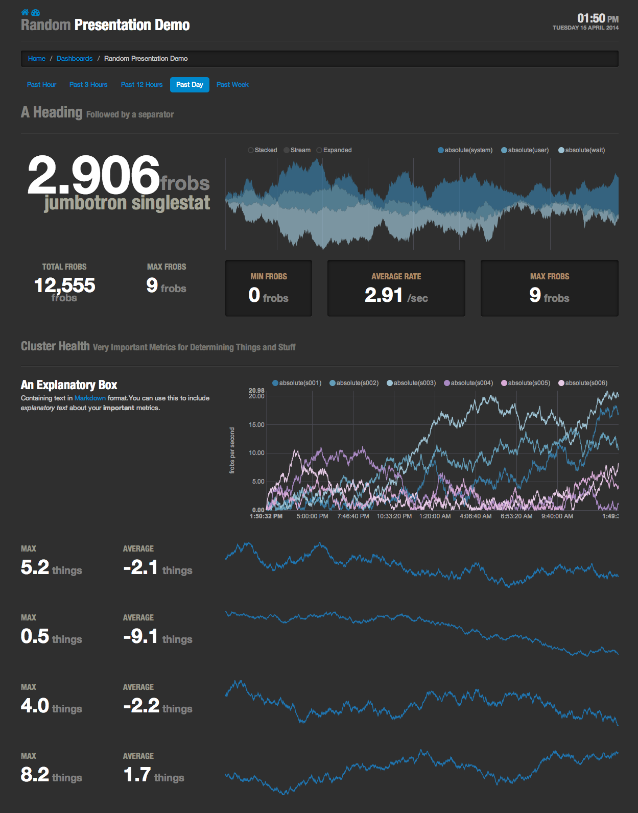

# Cronenberg

A dashboard front-end for Graphite.




## Dependencies ##

Server Side:

* [toolbox (UA)](https://github.com/urbanairship/toolbox)
* [Flask](http://flask.pocoo.org/)
* [Flask-Script](http://packages.python.org/Flask-Script/)
* [requests](https://github.com/kennethreitz/requests)

Client Side:

* [Twitter Bootstrap](http://twitter.github.com/bootstrap)
  * [Font Awesome](http://fortawesome.github.com/Font-Awesome/)
  * [darkstrap](https://github.com/danneu/darkstrap)
* [jQuery](http://jquery.com/)
* [nvd3](https://github.com/novus/nvd3) for interactive charts build
  on top of [d3](http://d3js.org). d3 is also used for value
  formatting in text.
* [moment.js](http://momentjs.com/) for time parsing & formatting.
* [bean.js](https://github.com/fat/bean) for events.
* [handlebars.js](http://handlebarsjs.com/) for client side templating.
* [markdown-js](https://github.com/evilstreak/markdown-js) for rendering of Markdown to HTML.

## Developing or Running from Source ##

```shell
git clone git@github.com:urbanairship/cronenberg.git
cd cronenberg
virtualenv .
. bin/activate

# Export pip environment variables if you didn't globally
export PIP_NO_INDEX=1
export PIP_FIND_LINKS=http://pulp.prod.urbanairship.com/repos/python-packages/

# If you are on a Mac and have XCode 5.1 installed, you'll need
# this set before installing the dependencies from requirements.txt:
export ARCHFLAGS=-Wno-error=unused-command-line-argument-hard-error-in-future

# Install dependencies
pip install -r requirements.txt

# Run it (defaults to http://localhost:5000)
./manage.py run
```
