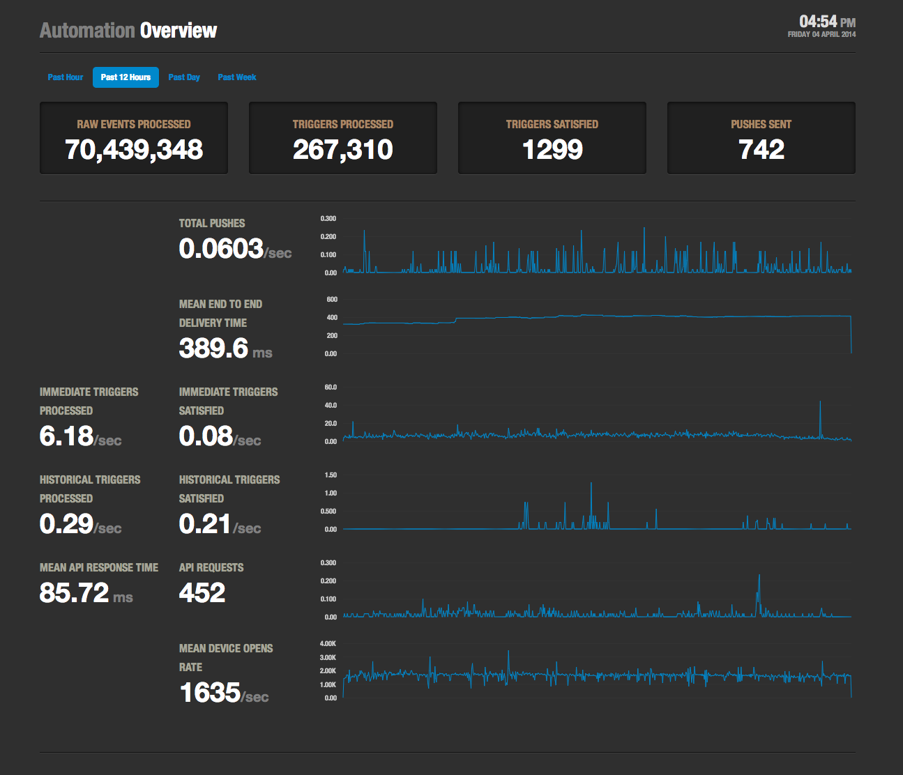

# Cronenberg

An executive dashboard for Automation. A lot of this is ripped from
the old [OpenDash](https://github.com/urbanairship/opendash/)
project. Currently a bit of a mess due to being rushed in time for
demoing. 



## Dependencies ##

Server Side:

* [toolbox (UA)](https://github.com/urbanairship/toolbox)
* [Flask](http://flask.pocoo.org/)
* [Flask-Script](http://packages.python.org/Flask-Script/)
* [requests](https://github.com/kennethreitz/requests)

Client Side:

* [Twitter Bootstrap](http://twitter.github.com/bootstrap)
  * [Font Awesome](http://fortawesome.github.com/Font-Awesome/)
  * [darkstrap](https://github.com/danneu/darkstrap)
* [jQuery](http://jquery.com/)
* [Flot](https://github.com/flot/flot)
  * [flot-multihighlight](https://github.com/eugenijusr/flot.multihighlight)
  * [flot-axislables](https://github.com/markrcote/flot-axislabels)

## Developing or Running from Source ##

```shell
git clone git@github.com:urbanairship/cronenberg.git
cd cronenberg
virtualenv .
. bin/activate

# Export pip environment variables if you didn't globally
export PIP_NO_INDEX=1
export PIP_FIND_LINKS=http://pulp.prod.urbanairship.com/repos/python-packages/

# If you are on a Mac and have XCode 5.1 installed, you'll need
# this set before installing the dependencies from requirements.txt:
export ARCHFLAGS=-Wno-error=unused-command-line-argument-hard-error-in-future

# Install dependencies
pip install -r requirements.txt

# Run it (defaults to http://localhost:5000)
./manage.py run
```

