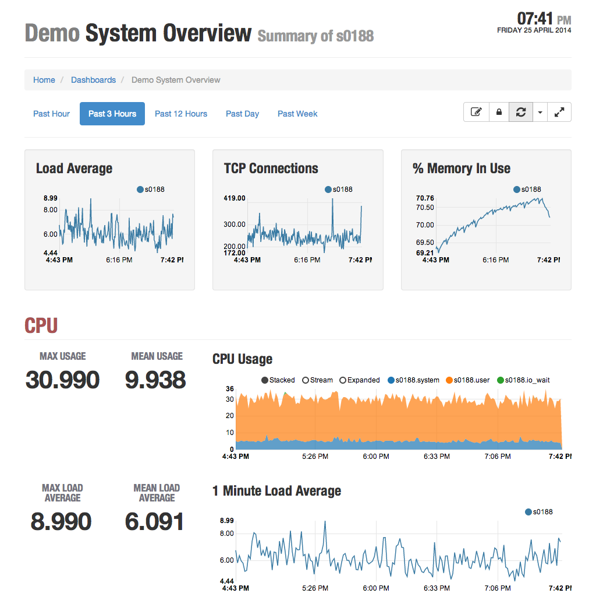

# Cronenberg

A dashboard front-end for Graphite.

## Overview

Words. Words about pictures.


## Getting Started

In order to get this project running from source, you will need to have python, 
node.js, and a C compiler installed. node.js is used for building the web assets, 
but is not used for running the server. 

### Setting up the Python Environment

```shell
git clone git@github.com:urbanairship/cronenberg.git
cd cronenberg
virtualenv .
. bin/activate

# If you are on a Mac and have XCode 5.1 installed, you'll need this
# set before installing the dependencies from requirements.txt for
# SQLAlchemy's C extensions to compile.  export
export ARCHFLAGS=-Wno-error=unused-command-line-argument-hard-error-in-future

# Install dependencies
pip install -r requirements.txt
```

### Setting up the Javascript Environment

Javascript code is bundled using [Grunt](http://gruntjs.com/). To set
up grunt and generate the bundled .js files that the web app loads:

```shell
npm install -g grunt-cli
npm install
grunt
```

If you're going to edit the javascript files and wish to automatically
regenerate the bundled files as they're edited, run

```
grunt watch &
```

### Create the database and run

Cronenberg runs off of a sqlite backing store, which has to be
initialized, and can be populated with a bunch of demo dashboards. To
initialize the database and generate the demo dashboards:

```shell
./manage.py initdb
```

And to run it from source:

```
# Run it (defaults to http://localhost:5000)
./manage.py run
```

### Importing Dashboards from Graphite-Web

Importing dashboard definitions from the built-in dashboard system in
graphite-web is currently supported, via the command
**import_graphite_dashboards**, which supports four optional
arguments **query**, **layout**, and **columns**, and **overwrite**.

By default, the importer will skip any dashboards that have already
been imported, as determined by the original dashboard URL in
``Dashboard.imported_from``. To re-import a dashboard, overwriting the
definition, supply ``--overwrite`` on the command line.

To import everything with default settings, which will create a 4
column fluid layout:

```shell
$ manage.py import_graphite_dashboards
```

You can import a subset of dashboards with the ``--query`` parameter.

```shell
$ manage.py import_graphite_dashboards --query=hbase
```

The importer also allows specify the basic layout type (``fluid`` or
``fixed``), and the number of columns.

```shell
$ manage.py import_graphite_dashboards --query=api --layout=fixed --columns=1
```

### Third-Party Code ###

Server Side:

* [Flask](http://flask.pocoo.org/)
* [Flask-Script](http://packages.python.org/Flask-Script/)
* [Flask-SQLAlchemy](http://pythonhosted.org/Flask-SQLAlchemy/)
* [requests](https://github.com/kennethreitz/requests)
* [inflection](https://github.com/jpvanhal/inflection)

Client Side:

* [Bootstrap](http://getbootstrap.com/)
  * [Font Awesome](http://fortawesome.github.com/Font-Awesome/)
  * [darkstrap](https://github.com/danneu/darkstrap)
  * The extracted
    [callouts](https://gist.github.com/matthiasg/6153853) from
    bootstrap's documentation site.
  * [bootbox](http://bootboxjs.com/) simplifies modal dialog interactions.
  * [bootstrap-validator](http://bootstrapvalidator.com/)
  * [bootstrap-growl](https://github.com/mouse0270/bootstrap-growl)
* [jQuery](http://jquery.com/)
* [nvd3](https://github.com/novus/nvd3) for interactive charts build
  on top of [d3](http://d3js.org). d3 is also used for value
  formatting in text.
* [moment.js](http://momentjs.com/) for time parsing & formatting.
* [bean.js](https://github.com/fat/bean) for events.
* [handlebars.js](http://handlebarsjs.com/) for client side templating.
* [marked](https://github.com/chjj/marked) for Markdown support.
* [highlight.js](http://highlightjs.org/)
* [URI.js](https://github.com/medialize/URI.js) for URL manipulation.
* [limivorous](https://github.com/aalpern/limivorous)
* [tagmanager](https://github.com/max-favilli/tagmanager)


### Screenshot


