# Tutorial

This tutorial introduces the editing user interface by walking through creating the simplest possible dashboard - one with a single query for random data, and two visualizations. 

## Create a blank dashboard

Once you've got Tessera running, launch a browser and load up the front page. If you're running with the default config from source, it will be at [localhost:5000](http://localhost:5000). 

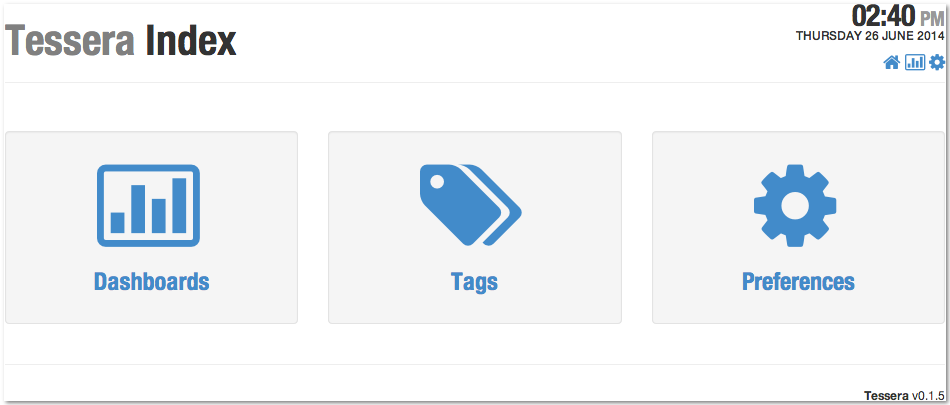

Click on the _Dashboards_ icon to go to the dashboard listing page, which is where you can create a new dashboard from. 

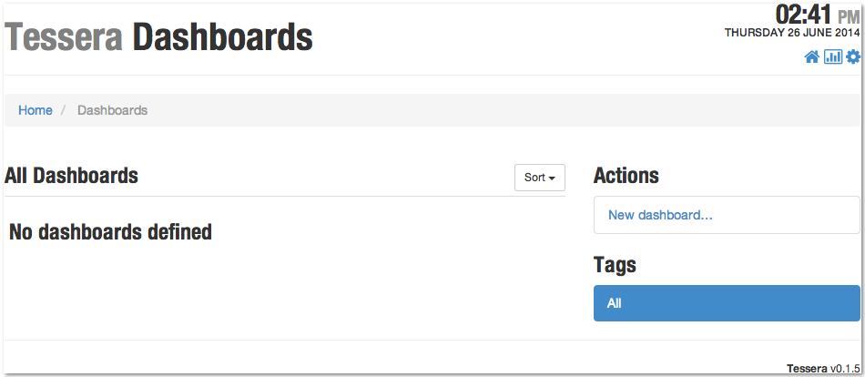

Click on _New dashboard..._, then fill in some data in the form. The only required field is the title. 

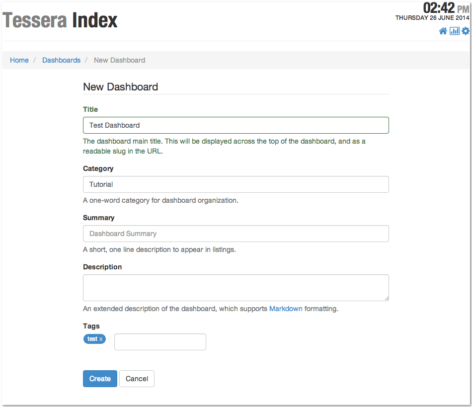

## Open the Editor

From the blank new dashboard that results, click on the _Edit_ button in the main toolbar. 

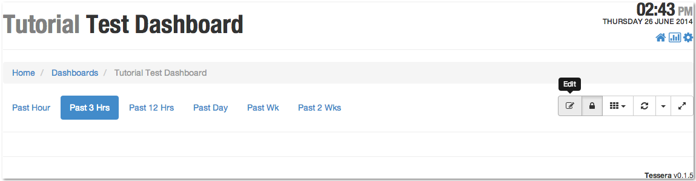

## Create a Data Query

Before laying out any elements, we need a data query. In the metadata panel that opened when you entered edit mode, click on the _Queries_ tab, then click the _+_ button to add a new query. 

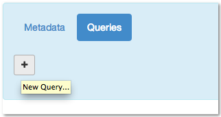

That will create a new query with a placeholder Graphite expression to generate some random data. 

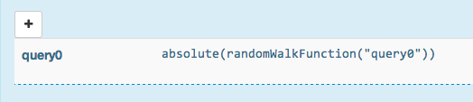

## Create the Initial Layout

In order to add anything to the dashboard, you have to start with a _section_ at the top level. Click the _+_ button in the main toolbar to add a new section. 

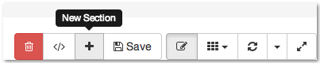

In edit mode, all items have a shaded title bar, with a badge in the upper left corner indicating the item's type and ID. Clicking on the badge will open a property sheet allowing you to edit that item. 

After opening the property sheet for the section, add a new row to the section by clicking the Add button (labeled _+_) and selecting _Add new Row_ from the menu. 

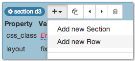

The only items that you can add to rows are cells, which control the placement and width of presentations. Click on the _+_ button to add a new cell to the row. 

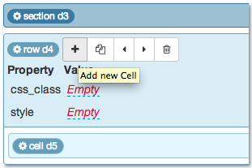

Next, add a **Standard Time Series** chart to the cell. Click on the cell header badge to open the property sheet, then click on the _+_ button and select _Add new Standard Time Series_ from the menu. 

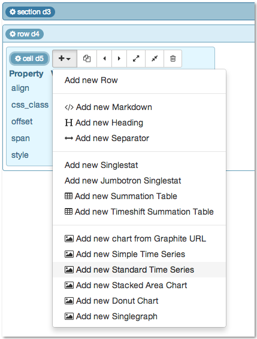

Open the property sheet for the new time series, and set the value of the query property. Click on the _Empty_ placeholder value and select `query0` from the popup menu. Confirm the choice by either clicking the checkmark button or pressing _Enter_ on the keyboard. 

Once you've set the query, the time series chart will immediately render. 

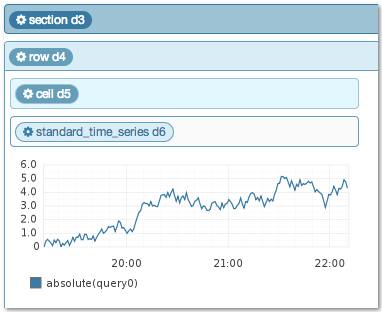

At this point it would be a good idea to save the edits - go back up to the main toolbar and click the _Save_ button. Alternatively, you can save instantly with the `ctrl-shift-s` keyboard shortcut. 

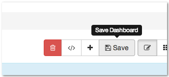

Exit edit mode by click on the edit button again, or with the `ctrl-shift-e` keyboard shortcut. 

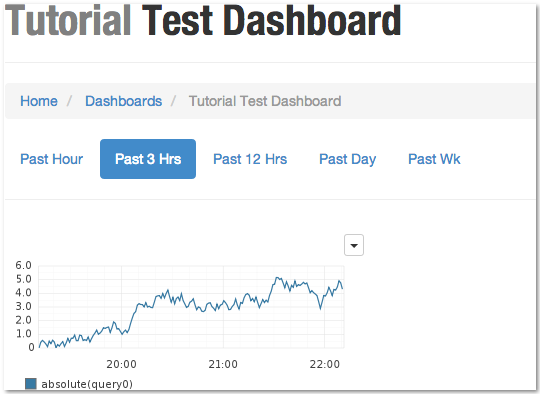

Congratulations, it's a dashboard!
